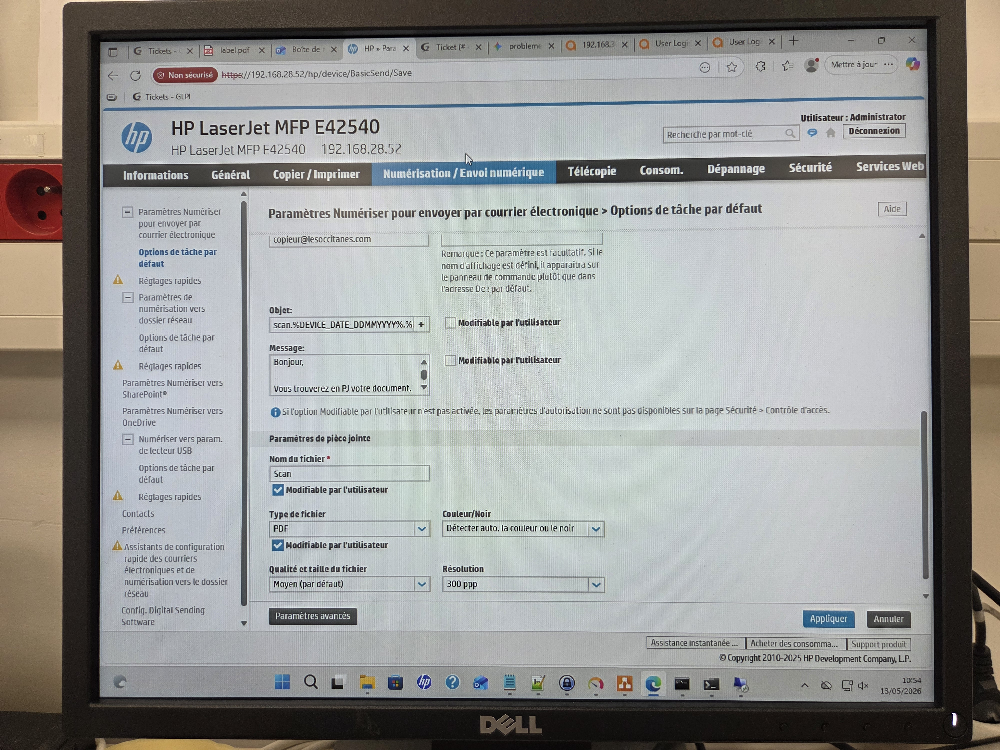
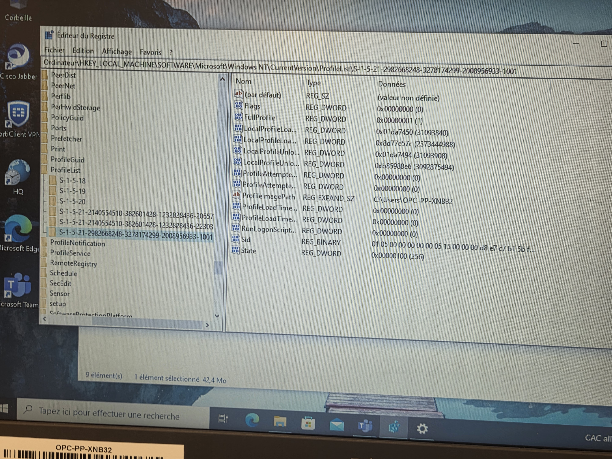
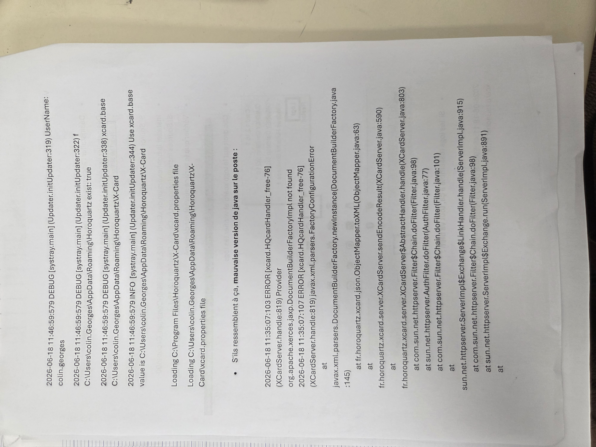
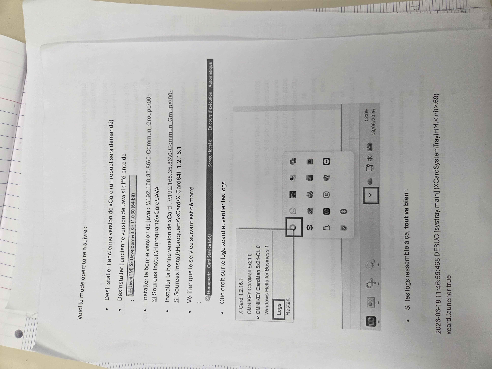
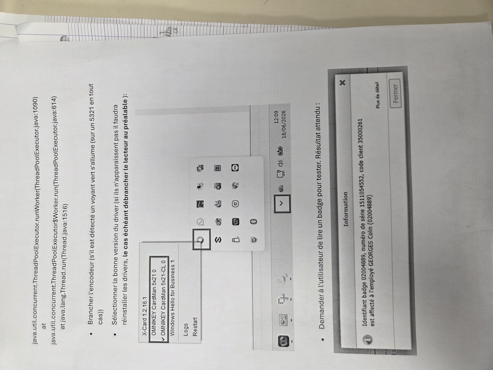
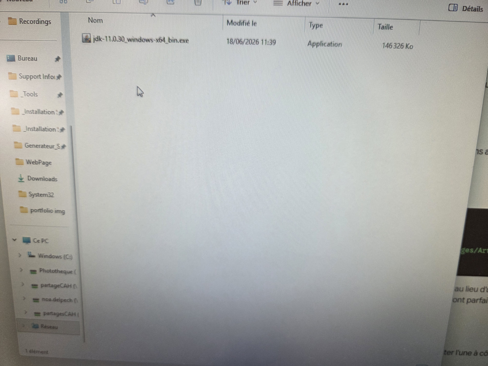
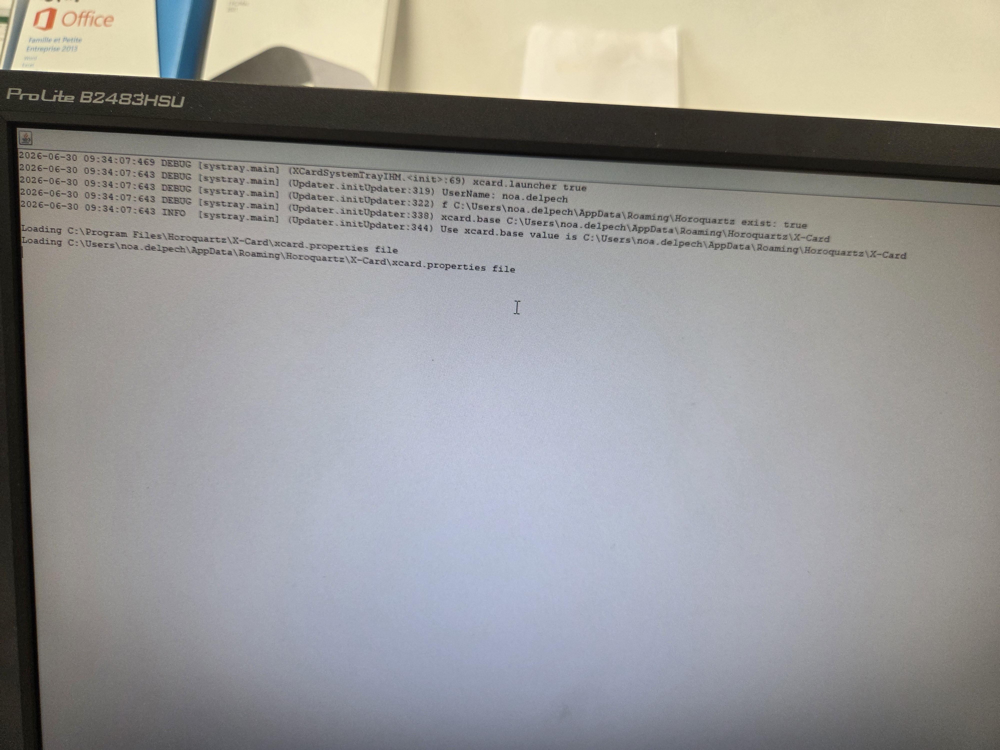
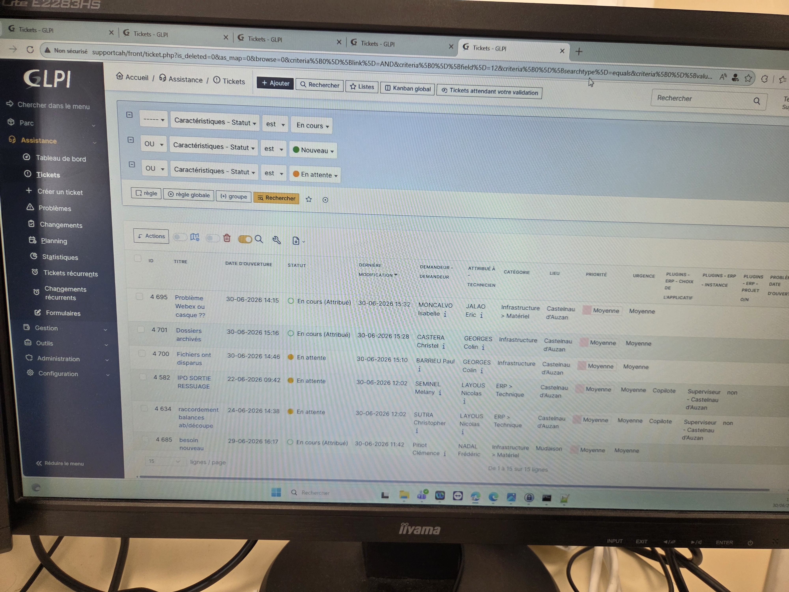
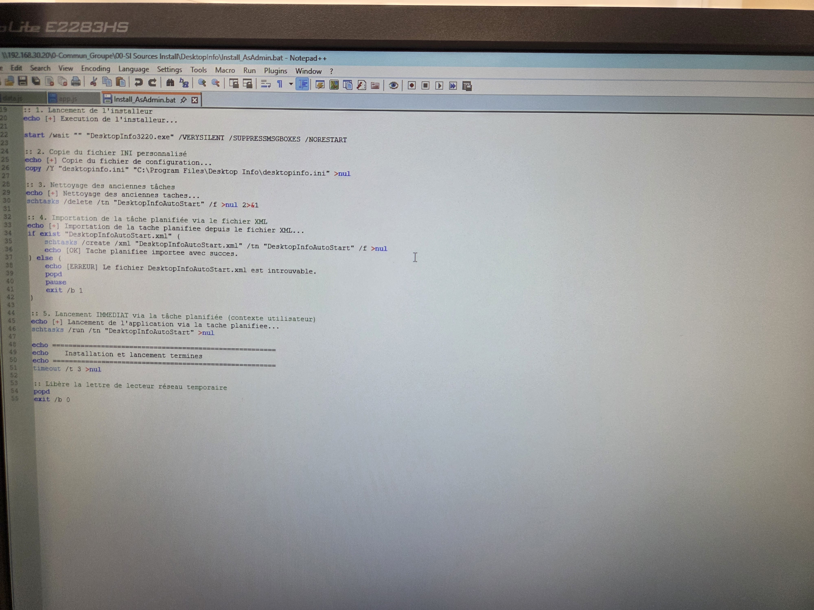

# 💼 Stage de 1ère Année

## 🏢 Présentation de l'Entreprise
* **Nom :** Occitanes Plats Cuisinés
* **Secteur d'activité :** Service informatique
* **Période :** 11 mai au 26 juin
* **Mon rôle :** Stagiaire Informatique (Support et Réseau / Développement)

---

## 🛠️ Missions et Réalisations

### 🔹 Mission 1 : Installatoin d'un window 11 sur plusieurs postes 
* **Contexte :** L'ancien PC avait déja un window mais c'étais window 10 , j'ai donc du lui mettre un window 11 . 
* **Actions réalisées :**
 1. Mettre la clé qui contient window 11 avant de démarrer le pc

 2. Allumez le pc en cliquant en continue sur F12 pour pouvoir acceder au BIOS

 3. Sélectionnez la clé qui contient window 11

 
 4. Poursuite de l'installation de window (langue , disque , nom )

  

  

5. Une fois l'installation faites , il manque plus cas mettre l'ordinateur dans le domaine .

---

### 🔹 Mission 2 : Problème sur les switchs et ports fibres changement.
* **Contexte :** Mon tuteur de stage c'est aperçu que le réseau était lent et que quelques informations avaient du mal à passaient/communniquaient
* **Actions réalisées :**
 1. Déplacement directement devant les baies pour regarder directement sur le swtich les ports fibres et les connecteurs fibres
 
 2. changement de connecteurs fibres des switchs
 
   

    

3. Passage sur tout les swtichs de l'entreprises pour voir si il n'y a pas un problème et qu'ils sont bien configurés.

   

    

---

### 🔹 Mission 3 : Problème d'imprimante de l'acceuil. L'imprimante n'imprime pas bien , il y a un problème de résolution
* **Contexte :** La personne de la RH est passé me voir en m'informant que l'imprimante de l'acceuil avait un problème en me montrant aussi comment elle imprimer .
* **Actions réalisées :**
 1. Déplacement vers l'imprimante pour relever son identifiant . ici l'imprimante avait pour identifiant : CSTIMP003
 
 2. Recherchez dans le KEPASS l'imprimante pour avoir son adresse IP

 3. Se connecter à l'imprimante en tapant son adresse IP dans la barre de recherche
 
  

 4. Modification de la résolution et problème résolu.
 
  ---

### 🔹 Mission 4 : Supprimer des profils dans le registre.
* **Contexte :** Des profils avaient été mal supprimer ou il y avait des comptes dis "fantomes".
* **Actions réalisées :**
 1. Allez dans la barre de recherche windows
 
 2. Tapez "registre"

 3. Puis faire le chemin suivant :HKEY_LOCAL-MACHINE\SOFTWARE\Microsoft\Windows NT\CurrentVersion\ProfileList\S-1-5-21-2982668248-3278174299-2008956933-1001
 
  

 4. Profile restant = Clique droit supprimer
 
 ---

### 🔹 Mission 5 : Changement de routeur 4G
* **Contexte :** Problème avec le routeur 4G qui ne permet plus de capter la 4G et donc en concéquences , impossible de voir des informations concernant la production , ceux qui peux entrainer une énorme perte d'argent.
* **Actions réalisées :**
 1. Achat d'un routeur 5G
 
 2. Récoltez les informations sur l'ancien routeur pour pouvoir le mettre au nouveau routeur

 3. Progammation du nouveau routeur , on branche le routeur et le pc en direct avec un cable RJ45

 4. On enléve toute connexion au pc puis après on rentre dans l'invite de commande et on tape : ipconfig
 
  

 5. On prend la passerelle que l'invite de commande nous affiche ici : 192.168.1.1

 6. On met cette adresse IP dans la barre de recherche se qui va nous amener sur le nouveau routeur et on a plus cas le programmer (mot de passe , passerelle , plage IP ) avec les meme paramètres que l'ancien.

  
 
 ---

 ### 🔹 Mission 6 : Mise à jour horoqwartz + nouveau java et xCard
* **Contexte :** Suite à une mise à jours de horoqwart , un problème est survenu dans l'application xCard , ce n'était plus la bonne version et de meme pour java
* **Actions réalisées :**
 1. Changement de version sur les ordinateurs des personnes de la RH

   
 
 2. Regardez si les personnes ont les bonnes versions . si elles ne l'ont pas , ont désinstalle puis on reinstalle les bonnes versions

    

 3. On regerde ensuite si l'application à bien démarrais dans le service puis ont regardes si l'applications à les bon logs.

  

 5. Une fois que c'est fait , les personnes RH on plus cas tester. 

 ---

  ### 🔹 Mission 7 : Codage d'un mini logiciel
* **Contexte :** Codage d'un mini logiciel qui permet de faire le numéro du spport informatique , le nom du pc et un URL qui redirige vers GLPI
* **Actions réalisées :**
 1. Codage d'un mini logiciel sur notepad sauvergardé en .bat où le but est de facilité la vie d'abord à l'informatique grace au nom du pc qui est afficher sur l'écran si on veut prendre le controle du pc à distance et aussi au personne qui utilise le pc qui ne perdrons pas de temps à chercher le nom quand on leur demande. De plus un accès plus facile au utilisateur pour pouvoir accèder à GLPI pour faire des tickets quand ils ont des problèmes et non venir nous soliciter en venant nous voir directement.
 
   
 
 ---
## 📈 Bilan du Stage
Ce stage m'a permis de découvrir le fonctionnement d'un service informatique en conditions réelles. J'ai pu développer mon autonomie, ma rigueur et apprendre à [cite une compétence humaine ou technique marquante].
