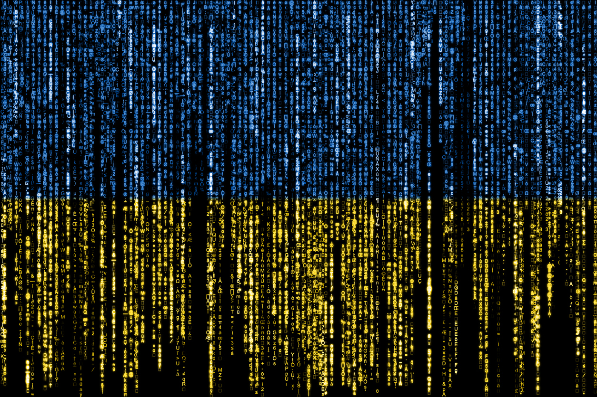

# 🔍 Veille Technologique : La Cybersécurité

Bienvenue sur ma section dédiée à la veille technologique sur la cybersécurité. J'étudie ici les évolutions des menaces informatiques et les nouvelles méthodes de protection.

---

## 📌 Mes Outils de Veille
* **Sources utilisées :** Le Monde , Feedly
* **Outils de centralisation :** github

---

## 📰 Mes Articles de Veille

### 📑 Article 1 : Le ministère des Sports victime d’une fuite de données de « Mon compte Asso »
* **Lien vers la source :** https://incyber.org/article/ministere-sports-victime-fuite-donnees-mon-compte-asso/
  
* **Résumé et analyse :** Le site French Breaches a révélé, le 29 juin 2026, que le ministère des Sports, de la Jeunesse et de la Vie associative avait confirmé qu’une fuite de données affectait le service de demande de subvention « Mon compte Asso ». Dans un courrier, le ministère a indiqué aux associations concernées qu’un pirate informatique avait dérobé une partie des informations saisies avant de les mettre en vente sur un forum cybercriminel.
  

---

### 📑 Article 2 : Cybermalveillance.gouv.fr lance la MalletteCyber Pro à destination des TPE-PME
* **Lien vers la source :** https://incyber.org/article/cybermalveillance-gouv-fr-lance-la-mallettecyber-pro-a-destination-des-tpe-pme/
  
* **Résumé et analyse :** La plateforme nationale d’assistance cyber annonce un nouvel outil de sensibilisation gratuit à destination des petites et moyennes entreprises, présenté à l’occasion de la Grande Assemblée des Entrepreneurs.

  

---
### 📑 Article 3 : Opération Endgame : Europol coordonne le démantèlement d’Amadey et de StealC
* **Lien vers la source :** https://incyber.org/article/operation-endgame-europol-coordonne-demantelement-amadey-stealc/

* **Résumé et analyse :** Europol a annoncé, le 24 juin 2026, avoir coordonné, dans le cadre de l’opération Endgame, le démantèlement de l’infrastructure de trois logiciels malveillants : Amadey, StealC et SocGholish. Les autorités de six pays ont participé à cette action : Allemagne, Canada, Danemark, États-Unis, Pays-Bas, Royaume-Uni. Elles ont déconnecté 326 serveurs, 142 domaines, plus de 200 infrastructures C2, et saisi 27 millions d’identifiants volés.

 

 ---

### 📑 Article 4 : Bajaj Auto, géant indien de l’automobile, victime d’une attaque par rançongiciel.
* **Lien vers la source :** https://incyber.org/article/bajaj-auto-geant-indien-automobile-victime-attaque-par-rancongiciel/

* **Résumé et analyse :** Le constructeur automobile indien Bajaj Auto a annoncé, le 23 juin 2026, être victime d’une attaque par rançongiciel, qui a affecté ses activités et celles de sa filiale spécialisée dans le développement technologique, Bajaj Auto Technology Limited. La firme affirme que ses équipes de cybersécurité ont réagi dès la découverte de l’incident : leurs efforts de remédiation auraient été, jusqu’à présent, « couronnés de succès ».

 

 ---

### 📑 Article 5 : Ukraine : une cyberattaque pro-russe perturbe l’application de l’opérateur postal public
* **Lien vers la source :** https://incyber.org/article/ukraine-cyberattaque-pro-russe-perturbe-application-operateur-postal-public/

* **Résumé et analyse :** L’opérateur postal public ukrainien Ukrposhta a déclaré, le 25 juin 2026, que son application mobile connaissait des perturbations à la suite d’une cyberattaque « ennemie ». « Nos spécialistes s’emploient déjà à rétablir le service. Nous mettons tout en œuvre pour que vous puissiez à nouveau utiliser l’application normalement dès que possible », lit-on dans le communiqué de l’entreprise.

---

### 📑 Article 6 : Deux membres de Scattered Spider plaident coupables du piratage de Transport for London
* **Lien vers la source :** https://incyber.org/article/deux-membres-scattered-spider-plaident-coupables-piratage-transport-for-london/

* **Résumé et analyse :** Deux membres du groupe de cybercriminels anglophones Scattered Spider ont plaidé coupables, le 22 juin 2026, d’une cyberattaque contre Transport for London (TfL), l’autorité des transports de Londres, en septembre 2024. Le piratage avait perturbé les services pendant plusieurs mois, exposé les données des usagers et causé environ 29 millions de livres sterling de pertes (34 millions d’euros).

---

### 📑 Article 7 : MesVaccins.net victime d’une fuite de données
* **Lien vers la source :** https://incyber.org/article/mesvaccins-net-victime-fuite-donnees/

* **Résumé et analyse :** Syadem, éditeur de MesVaccins.net, a indiqué, le 24 juin 2026, qu’un tiers non autorisé avait accédé à des données personnelles de la plateforme et les avait exfiltrées. MesVaccins.net propose un carnet de vaccination numérique (CVN) destiné aux particuliers ainsi qu’aux professionnels de santé. Il permet d’enregistrer les vaccinations, de recevoir des rappels et d’accéder à des recommandations vaccinales personnalisées.

---

### 📑 Article 8 : Fuite de données à la Fédération sportive de la police nationale : 224 000 personnes concernées
* **Lien vers la source :** https://incyber.org/article/fuite-donnees-federation-sportive-de-la-police-nationale-224-000-personnes-concernees/

* **Résumé et analyse :** La Fédération sportive de la police nationale (FSPN) a annoncé, le 21 juin 2026, avoir déposé plainte après une fuite de données probablement liée à une cyberattaque. « Les données piratées pourraient remonter sur plusieurs années de licences FSPN », lit-on dans le communiqué de l’organisation.

---

### 📑 Article 9 : Abonnements payants sur les réseaux sociaux : une nouvelle arme pour identifier les auteurs de contenus illicites
* **Lien vers la source :** https://incyber.org/article/abonnements-payants-sur-les-reseaux-sociaux-une-nouvelle-arme-pour-identifier-les-auteurs-de-contenus-illicites/

* **Résumé et analyse :** Sur les réseaux sociaux, n’importe qui peut publier n’importe quoi sous un pseudonyme. Pour les victimes de contenus diffamatoires ou harcelants, retrouver la personne qui se cache derrière un compte anonyme est un défi majeur. L’affaire jugée le 9 janvier 2026 en est un exemple parlant.

---

### 📑 Article 10 : Démantèlement du botnet SocGholish, pilier de l’écosystème cybercriminel russe
* **Lien vers la source :** https://incyber.org/article/demantelement-botnet-socgholish-pilier-ecosysteme-cybercriminel-russe/

* **Résumé et analyse :** Les autorités néerlandaises, canadiennes, américaines et allemandes ont annoncé, le 18 juin 2026, avoir démantelé des « éléments clés » du botnet SocGholish, une infrastructure largement exploitée par l’écosystème cybercriminel russe. Une opération de police internationale a conduit à la saisie de noms de domaine et à la fermeture de serveurs utilisés pour infecter les visiteurs de sites web, notamment ceux appartenant à de petites entreprises.

---

### 📑 Article 11 : Utiq, le mouchard ultime, monte en puissance
* **Lien vers la source :** https://incyber.org/article/utiq-mouchard-ultime-monte-puissance/

* **Résumé et analyse :** Coup de tonnerre dans le monde des télécoms : le marché mobile et internet français pourrait bientôt passer de quatre à trois opérateurs. Le protocole d’accord signé début juin entre Altice France et le trio Bouygues Telecom, Free-Iliad et Orange valorise SFR à 20,35 milliards d’euros. La route réglementaire, sociale et financière est encore longue d’ici le second semestre 2027, période envisagée pour le démantèlement de SFR entre ses trois concurrents, mais les enjeux immédiats sont clairs : moins de concurrence, risque de hausse des prix, inquiétudes sociales, mais promesse d’investissements massifs.

---

### 📑 Article 12 : L’Ukraine rejoint la réserve de cybersécurité de l’Union européenne
* **Lien vers la source :** https://incyber.org/article/lukraine-rejoint-reserve-de-cybersecurite-union-europeenne/

* **Résumé et analyse :** L’Union européenne a annoncé, le 15 juin 2026, l’intégration de l’Ukraine à sa « réserve de cybersécurité », un mécanisme de réponse collective aux incidents cyber majeurs, géré par l’Agence de l’UE pour la cybersécurité (ENISA). Ce dispositif n’est pas réservé aux États membres de l’UE, mais ouvert à tous les pays tiers liés au programme « Europe numérique ».

---

### 📑 Article 13 : France : Searcher, le moteur indexant des données personnelles volées, visé par la justice
* **Lien vers la source :** https://incyber.org/article/france-searcher-moteur-indexant-donnees-personnelles-volees-vise-par-justice/

* **Résumé et analyse :** Le site Searcher, un moteur de recherche français donnant accès à des données volées, a annoncé, le 15 juin 2026, la fermeture de sa version gratuite. Ouvert début juin 2026, le site agrège, selon Franceinfo, 1,2 milliard de données issues de piratages informatiques, notamment des bases volées à l’ANTS et à l’Assurance maladie, croisées avec des sources publiques comme l’Insee ou des plateformes administratives. Gratuit lors de son lancement, Searcher a introduit un modèle payant le 12 juin 2026.

---

### 📑 Article 14 : Le secteur technologique, cible privilégiée des cybercriminels affiliés à la Chine
* **Lien vers la source :** https://incyber.org/article/secteur-technologique-cible-privilegiee-cybercriminels-affilies-chine/

* **Résumé et analyse :** La société de cybersécurité CrowdStrike a publié, mi-juin 2026, son rapport annuel sur les menaces visant le secteur technologique. Cet écosystème demeure la première cible de la cybercriminalité mondiale, en particulier des acteurs chinois : 58 % des intrusions étatiques dirigées contre lui sont liées à Pékin.

---

### 📑 Article 15 : Almerys : une nouvelle cyberattaque qui interroge la résilience du tiers payant
* **Lien vers la source :** https://incyber.org/article/almerys-une-nouvelle-cyberattaque-qui-interroge-la-resilience-du-tiers-payant/

* **Résumé et analyse :** Le 26 mai 2026, Almerys a confirmé la compromission de son site de délivrance des prises en charge, après plusieurs alertes adressées aux assurés par des organismes complémentaires. Alan, AG2R La Mondiale et Aesio mutuelle avaient notamment informé leurs bénéficiaires dès le week-end précédent. Le tiers payant permet aux assurés de ne pas avancer certains frais de santé, ce qui impose aux opérateurs concernés de vérifier les droits et les contrats auprès de multiples organismes.

---

### 📑 Article 16 : RATP : une fuite de données pourrait concerner plus de 62 000 employés
* **Lien vers la source :** https://incyber.org/article/ratp-une-fuite-de-donnees-pourrait-concerner-plus-de-62-000-employes/

* **Résumé et analyse :** La RATP fait face à une possible fuite de données concernant plus de 62 000 employés. Selon une publication apparue sur un forum du Dark Web, un cybercriminel affirme avoir obtenu un fichier contenant diverses informations professionnelles, telles que les noms, adresses e-mail, fonctions, services, identifiants internes et données organisationnelles des collaborateurs. 

---
